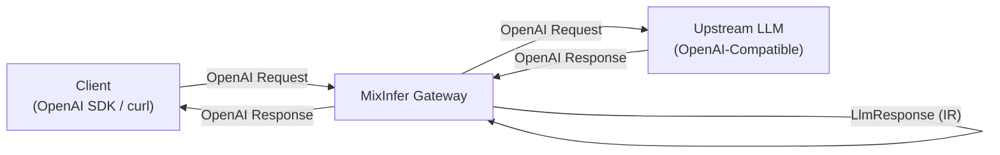
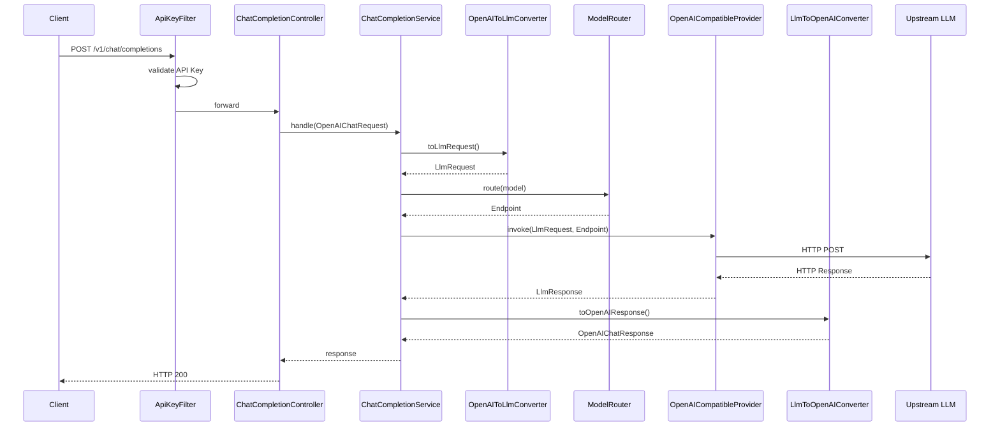

# MixInfer Architecture

> 本文档描述 MixInfer V0.1 的整体架构与请求链路。
> 后续版本会在此文档上增量补充，不做破坏性修改。

## 1. Design Goals

MixInfer V0.1 的目标只有一个：

> **将客户端的 LLM 请求，经由 MixInfer，可靠地转发到任意 OpenAI-Compatible Endpoint，并以统一格式返回。**

围绕这个目标，V0.1 的架构设计遵循三条原则：

1. **语义先于协议** —— 内部模型（IR）描述"语义"，协议转换器处理"格式"。
2. **配置驱动** —— Provider / Endpoint / Model 通过配置声明，不硬编码。
3. **最小可运行** —— 不引入未使用的抽象，不预留未来的扩展点。

## 2. High-Level Flow



## 3. Request Pipeline

V0.1 的请求经过以下阶段：



## 4. Module Layout (V0.1)

```
mixinfer-gateway/
└── src/main/java/com/mixinfer/
    ├── config/        # 配置绑定（MixInferProperties）
    ├── domain/        # IR：LlmRequest / LlmResponse / ...
    ├── openai/        # OpenAI 兼容 DTO
    ├── converter/     # DTO <-> IR 转换
    ├── provider/      # LlmProvider SPI + OpenAICompatibleProvider
    ├── router/        # ModelRouter + Endpoint
    ├── auth/          # ApiKeyFilter
    ├── api/           # Controller
    ├── service/       # 编排层
    └── exception/     # 统一异常
```

## 5. Core Abstractions

### 5.1 LlmRequest / LlmResponse (IR)

**IR（Internal Representation）** 是 MixInfer 的核心抽象。

- 它描述**语义**，不描述**协议**。
- 每个字段的含义在所有 Provider 上一致。
- Provider 特有能力通过 `extensions` 字段透传。

详细设计见 [ir-design.md](./ir-design.md)。

### 5.2 LlmProvider (SPI)

Provider 抽象接口。V0.1 只有一个实现：`OpenAICompatibleProvider`。

```java
public interface LlmProvider {
    String name();
    LlmResponse invoke(LlmRequest request, Endpoint endpoint);
}
```

### 5.3 Endpoint

`Endpoint` 是"如何调用某个 Provider 的一个具体入口"的封装：

- Provider 名称
- Base URL
- API Key
- 支持的模型列表
- 超时配置

### 5.4 ModelRouter

V0.1 的 Router 只做一件事：

> 逻辑模型名 → Endpoint

内部就是一个 `Map<String, Endpoint>` 的查询。不做负载均衡，不做 Fallback。

## 6. Configuration Example

```yaml
mixinfer:
  api-keys:
    - key: "sk-mixinfer-xxx"
      name: "default"
  providers:
    - name: openai-compatible
      base-url: https://api.openai.com/v1
      api-key: ${OPENAI_API_KEY}
      models:
        - gpt-4o-mini
        - gpt-4o
  routes:
    - model: gpt-4o-mini
      provider: openai-compatible
```

## 7. Non-Goals (V0.1)

以下内容明确**不在 V0.1 范围内**：

- 多租户 / RBAC
- Billing / Cost tracking
- 多 Provider Adapter
- 负载均衡 / Fallback
- 管理后台 Web UI
- SSE 流式的完整结算
- 多语言 SDK

这些会在后续版本逐步引入。见 [roadmap](../README.md#roadmap)。
