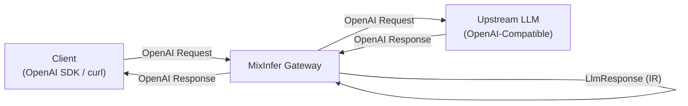
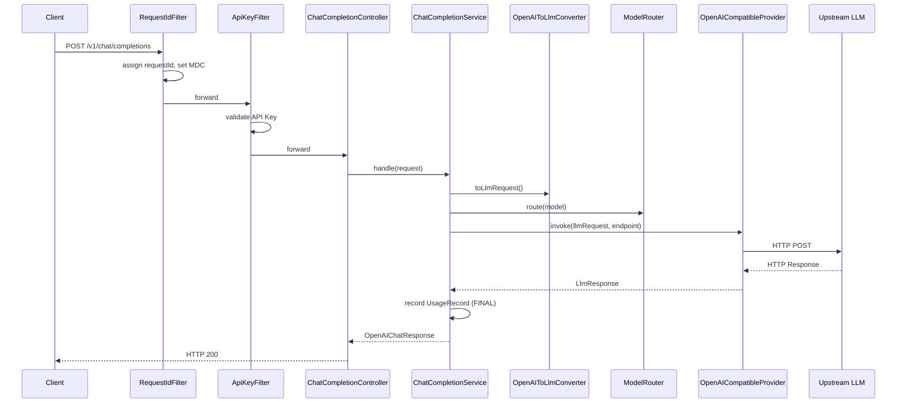
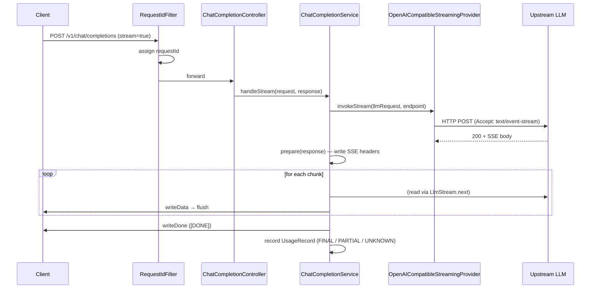

# MixInfer Architecture

> 本文档描述 MixInfer 的整体架构与请求链路。
> 后续版本会在此文档上增量补充，不做破坏性修改。

## 1. Design Goals

MixInfer 的核心目标：

> **将客户端的 LLM 请求，经由 MixInfer，可靠地转发到任意 OpenAI-Compatible Endpoint，并以统一格式返回——无论是否流式。**

架构设计遵循四条原则：

1. **语义先于协议** —— 内部模型（IR）描述"语义"，协议转换器处理"格式"。
2. **配置驱动** —— Provider / Endpoint / Model 通过配置声明，不硬编码。
3. **最小可运行** —— 不引入未使用的抽象，不预留未来的扩展点。
4. **可观测** —— 每个请求有 requestId，每次结算有状态。

## 2. High-Level Flow



## 3. Request Pipelines

### 3.1 Non-streaming



### 3.2 Streaming



**关键时序**：SSE 响应头只在**上游流成功打开后**才写出。如果路由失败、认证失败或上游返回 4xx/5xx，客户端仍能看到一个干净的 HTTP 错误响应，而不是半开的 SSE 连接。

### 3.3 Client disconnect

```
Client disconnect
    ↓
ServletOutputStream.flush() throws IOException
    ↓
ChatCompletionService catches IOException
    ↓
LlmStream.close() — cancels upstream HTTP connection
    ↓
UsageRecord(settlementStatus = UNKNOWN, reason = client_disconnected)
```

**没有这一步**，客户端断开后 MixInfer 会继续消耗上游 token 而无接收方。

## 4. Module Layout

```
mixinfer-gateway/
└── src/main/java/com/mixinfer/
    ├── config/        # 配置绑定（MixInferProperties）
    ├── domain/        # IR：LlmRequest / LlmResponse / LlmStreamChunk / UsageRecord
    ├── openai/        # OpenAI 兼容 DTO（请求、响应、流式、错误）
    ├── converter/     # DTO <-> IR 转换
    ├── provider/      # LlmProvider / StreamingLlmProvider SPI + OpenAI 实现
    ├── streaming/     # SSE 解析与响应写入
    ├── metering/      # 用量结算与落盘
    ├── router/        # ModelRouter + Endpoint
    ├── auth/          # ApiKeyFilter / ApiKeyValidator
    ├── web/           # Servlet 层横切组件（RequestIdFilter）
    ├── api/           # Controller
    ├── service/       # 编排层
    └── exception/     # 统一异常
```

## 5. Core Abstractions

### 5.1 LlmRequest / LlmResponse (IR)

**IR（Internal Representation）** 是 MixInfer 的核心抽象。

- 它描述**语义**，不描述**协议**。
- 每个字段的含义在所有 Provider 上一致。
- Provider 特有能力通过 `extensions` 字段透传。

详细设计见 [ADR-001](adr/001-use-semantic-ir.md)。

### 5.2 LlmStreamChunk（流式 IR）

流式响应的每个块是**增量**，不是完整响应。因此使用独立类型：

```java
public class LlmStreamChunk {
    String id;
    String model;
    int index;
    LlmMessageDelta delta;   // 增量内容
    String finishReason;     // 仅最后一块有
    LlmUsage usage;          // 仅最后一块有（如果上游返回）
}
```

`LlmStreamChunk` 是语义级 IR，不是 OpenAI chunk 的重命名。任何 Provider
都可以通过自己的 Stream Adapter 映射到它。

### 5.3 LlmProvider / StreamingLlmProvider (SPI)

两个独立接口：

```java
public interface LlmProvider {
    String name();
    LlmResponse invoke(LlmRequest request, Endpoint endpoint);
}

public interface StreamingLlmProvider {
    String name();
    LlmStream invokeStream(LlmRequest request, Endpoint endpoint);
}
```

**接口分离的理由**：不支持流式的 Provider（如某些内部 RPC 协议）不必实现流式。
服务层在收到 `stream: true` 但当前 Provider 不支持时，返回明确的错误。

### 5.4 LlmStream（流式 IO 抽象）

```java
public interface LlmStream extends AutoCloseable {
    LlmStreamChunk next() throws IOException;
    @Override
    void close();
}
```

**为什么不用 `Stream<LlmStreamChunk>`**：Java `Stream<T>` 建模有限惰性集合，
缺少资源释放、取消、IO 异常三类语义。`LlmStream` 是长生命周期、可中断的 IO 流，
必须显式建模。

### 5.5 Endpoint

`Endpoint` 是"如何调用某个 Provider 的一个具体入口"的封装：

- Provider 名称
- Base URL
- API Key
- 超时配置

### 5.6 ModelRouter

V0.2 的 Router 只做一件事：

> 逻辑模型名 → Endpoint

内部就是一个 `Map<String, Endpoint>` 的查询。不做负载均衡，不做 Fallback。

### 5.7 UsageRecorder

结算记录接口。V0.2 只有一个实现 `FileUsageRecorder`，将 `UsageRecord`
以 JSON Lines 追加写入文件。V0.4 会加入数据库实现。

## 6. Usage Settlement

流式场景下 usage 不是必然可得的：

- 某些上游不返回 usage
- 客户端断开时，MixInfer 无法知道上游实际生成了多少 token

因此结算是一个**显式状态机**：

| 场景 | settlementStatus | usageSource | reason |
|---|---|---|---|
| 正常结束（有 usage） | FINAL | PROVIDER | — |
| 正常结束（无 usage） | UNKNOWN | NONE | — |
| 客户端断开 | UNKNOWN | NONE | client_disconnected |
| 上游断开（有部分 usage） | PARTIAL | PROVIDER | upstream_stream_error |
| 上游断开（无 usage） | UNKNOWN | NONE | upstream_stream_error |

**核心原则**：客户端断开 ≠ 上游停止计费。诚实记录 `UNKNOWN`，比编造一个数字更专业。

## 7. Configuration Example

```yaml
mixinfer:
  api-keys:
    - key: "sk-mixinfer-xxx"
      name: "default"
  providers:
    - name: openai-compatible
      base-url: https://api.deepseek.com
      api-key: ${DEEPSEEK_API_KEY}
      models:
        - deepseek-flash
  routes:
    - model: deepseek-flash
      provider: openai-compatible
  usage:
    file: logs/usage.log
```

## 8. Non-Goals (V0.2)

以下内容明确**不在 V0.2 范围内**：

- 多租户 / RBAC
- Billing / Cost / Quota
- 多 Provider 协议（Anthropic / Gemini 原生）
- 负载均衡 / Fallback / Retry
- 健康检查
- 管理后台 Web UI
- 多语言 SDK
- 嵌入式模式

这些会在后续版本逐步引入。见 [README Roadmap](../README.md#roadmap)。